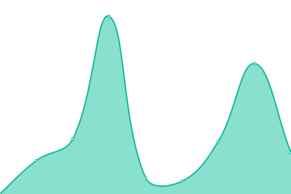

# [📈 Live Status](https://xaif.github.io/uptime-monitor): <!--live status--> **🟩 All systems operational**

This repository contains the open-source uptime monitor and status page for [Xaif](https://webverge.io), powered by [Upptime](https://github.com/upptime/upptime).

With [Upptime](https://upptime.js.org), you can get your own unlimited and free uptime monitor and status page, powered entirely by a GitHub repository. We use [Issues](https://github.com/xaif/uptime-monitor/issues) as incident reports, [Actions](https://github.com/xaif/uptime-monitor/actions) as uptime monitors, and [Pages](https://xaif.github.io/uptime-monitor) for the status page.

<!--start: status pages-->
<!-- This summary is generated by Upptime (https://github.com/upptime/upptime) -->
<!-- Do not edit this manually, your changes will be overwritten -->
<!-- prettier-ignore -->
| URL | Status | History | Response Time | Uptime |
| --- | ------ | ------- | ------------- | ------ |
|  [WebVerge](https://webverge.io) | 🟩 Up | [web-verge.yml](https://github.com/xaif/uptime-monitor/commits/HEAD/history/web-verge.yml) | 

 613ms
     
 | 

<a href="https://xaif.github.io/uptime-monitor/history/web-verge">100.00%</a>
    

|  [Blog](https://blog.webverge.io) | 🟩 Up | [blog.yml](https://github.com/xaif/uptime-monitor/commits/HEAD/history/blog.yml) | 

 281ms
     
 | 

<a href="https://xaif.github.io/uptime-monitor/history/blog">100.00%</a>
    

<!--end: status pages-->

[**Visit our status website →**](https://xaif.github.io/uptime-monitor)

## 📄 License

- Powered by: [Upptime](https://github.com/upptime/upptime)
- Code: [MIT](./LICENSE) © [Xaif](https://webverge.io)
